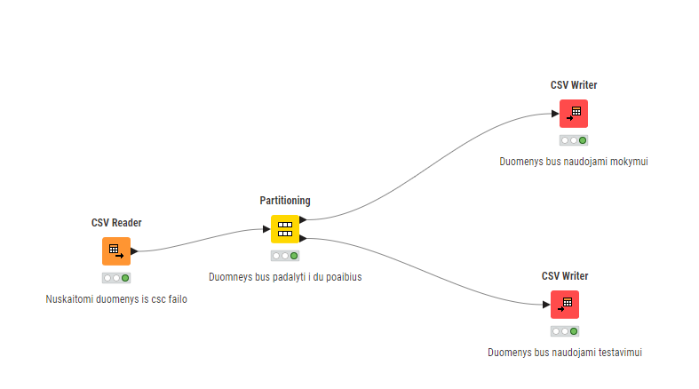

# Daugiasluoksnio Perceptrono Klasifikavimo Užduotis Naudojant KNIME

  
*A project exploring the application of multilayer perceptrons for classification tasks using the KNIME platform.*

---

## 📄 Project Overview

This project demonstrates the use of a **multilayer perceptron (MLP)** for solving classification tasks. The workflow includes:
- **Data Analysis**: Using the `iris.csv` dataset from the UCI repository.
- **Data Preparation**: Stratified sampling for training and testing datasets.
- **Model Training**: Training the MLP model using KNIME.
- **Hyperparameter Optimization**: Fine-tuning the model for better performance.
- **Result Visualization**: Comparing MLP results with other machine learning methods.

---

## 📂 Project Structure

---

## 📊 Key Results

- **Dataset**: The `iris.csv` dataset was split into:
  - **Training**: 120 records (40 per class)
  - **Testing**: 30 records (10 per class)
- **Model Performance**:
  - Accuracy: *[Add accuracy here]*
  - Comparison with other methods: *[Add comparison details]*

---

## 🛠️ Tools and Technologies

- **KNIME**: For data preparation, model training, and visualization.
- **LaTeX**: For creating the project report.
- **Python (optional)**: For additional data analysis and visualization.

---

## 📸 Visuals

### KNIME Workflow

### Result Visualization
*(Add a chart or graph here if available)*

---

## 📚 References

- Greenwade, G. D. (1993). The Comprehensive TeX Archive Network (CTAN). *TUGBoat*, 14(3), 342–351.

---

## 🚀 How to Run

1. Open the `iris.csv` dataset in KNIME.
2. Follow the workflow as shown in `KNIME_2.png`.
3. Train the MLP model and evaluate its performance.
4. Use the LaTeX file `Doc.tex` to generate the project report.

---

## 📬 Contact

For questions or collaboration, feel free to reach out:
- **Author**: Karolis Mikelionis

---
